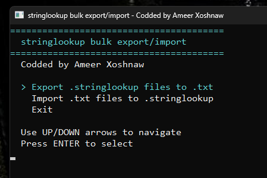

# StringLookup Bulk Export/Import

A lightweight utility for exporting and importing `.stringlookup` files in bulk.

This tool simplifies localization and translation workflows by converting `.stringlookup` files to plain text and importing edited text back into the original format.

## Screenshot

## Features

- Bulk export `.stringlookup` files to `.txt`
- Bulk import `.txt` files back to `.stringlookup`
- Fast batch processing
- Simple console interface
- Lightweight with no unnecessary dependencies

## Usage

### Export

1. Launch the program.
2. Select **Export .stringlookup files to .txt**.
3. Wait for the export process to finish.

### Import

1. Edit the exported `.txt` files.
2. Launch the program.
3. Select **Import .txt files to .stringlookup**.

## Notes

- Designed for batch processing.
- Preserves the original file structure during import/export.
- Always keep a backup of your original files before modifying them.

## Credits

Created by **Ameer Xoshnaw**

https://gamesinkurdish.com
